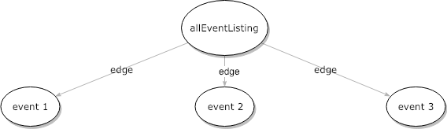
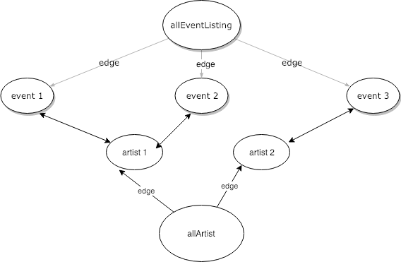

# Easily Manage Content with the 3G Stack (Gatsby, GraphQL, GraphCMS)

## What is the 3G stack?

Gatsby has been increasing in popularity over the last 18 months, in no small part to its ease-of-use in getting an optimised React app working. Initially,Gatsby's philosophy was to create blazing-fast, SEO-friendly static websites, but Gatsby has since become more than that. Lots of developers are now choosing to create their blogs and websites using Gatsby over other tools like Wordpress. When it comes to handling external data, the team at Gatsby has opted to use GraphQL, another popular technology taking over the dev world. GraphQL is an API query language that is used as an alternative to a traditional REST API. GraphQL allows developers to describe the shape of the data they want from an endpoint, which is one of the key differences from a REST API whose endpoints returns all information. There are many other differences between the two technologies, so please read the docs if you're unfamiliar, as this tutorial will only touch lightly on GraphQL.

## Why GraphCMS

GraphCMS makes the final piece of the 3G trifecta. It's a headless content managememt system, a CMS that exposes data via an API endpoint. It's easy to set-up and requires little overhead when integrating with a JavaScript application. There are other solutions we can use when it comes to handling content, like Wordpress and Contentful. Both GraphCMS and Contentful offer a similar functionality for use-cases relevant to this project, but I prefer GraphCMS's UX. I feel there's less friction when using GraphCMS to get a site up and running.

I'm hosting a workshop on getting a Gatsby application up and running from scratch. It takes place in London, February 2019. If you're interested you can find the event details [here](https://www.eventbrite.com/e/gatsbyjs-workshop-develop-and-deploy-your-own-blog-tickets-52432622385?aff=GardenPartyBlog). 

## What's a Garden Party?

Garden Party is a fictitious company that frequently hosts music concerts in a small garden stage. It's a good demo application that will get you used to consuming data from a GraphCMS endpoint. In a real-world application the GraphCMS content could be managed by a dedicated content team while you, the developer, hooks the website up to the endpoint, parses the data, and displays it. The majority of the application has already been created, but the data we use to display events and team members is mock data. To get the site fully functioning, we need to manage the content separately from the application code.

## Graph data model

Before we continue on to the article, I wanted to give a brief overview on how the graph data structure relates to our project. When we pull in of our events from GraphCMS, the GraphQL request will look like this:

```
{
  allEventListing {
    edges {
      node {
        name
        date
        time
      }
    }
  }
}
```

You'll see that we don't get a single array with all of our listings, but one object (`allEventListing`) containing an array (`edges`) where each entry holds an object (`node`). This object contains the listing information. This may seem like excessive nesting, but makes much more sense when viewed as a graph data structure. This is how GraphCMS structures our data:

<!-- eventListingGraph.jpg -->


Things could get more complicated if we choose to have artists as a data model, because one artist could perform at many events. These one-to-many and many-to-many relationships would end up making our data structure look like this:

<!-- eventListingAndArtistGraph.jpg -->


This would make our GraphQL query look like this: 

```
{
  allEventListing {
    edges {
      node {
        name
        date
        time
        artist {
          name
          songs
        }
      }
    }
  }
}
```

This is why GraphQL excels at handling these data types, because we're able to query these separate nodes that have relationships with each other using a single request. For the sake of brevity, I've kept this introduction to graph data types at a very high-level but if you want to learn more, I highly recommend [Gayle McDowell's introduction to them](https://www.youtube.com/watch?v=zaBhtODEL0w).

## Creating a project in GraphCMS

Sign up to GraphCMS and create a new project. You'll be prompted to choose a name, a region and a plan (hint: choose the free one).

The next step is creating the schema for our data. Schemas are a way for us to define the models and enumerations of the data set. A model is an object with one or more fields. For instance, a team member model describes the shape of data for each team member. Enumerations, or enums for short, can also be defined in GraphCMS. Enums are data types whose values must be one from a set of pre-defined values. Think of a team member's job role as one of 5 different job roles available. By defining what the values can be, we're reducing the capacity for human error when it comes to creating the team member data.

So before continuing, have another look at the Garden Party website and write down what you'd expect our event and team member data models to look like. You can have a look at the available data types [here](https://docs.graphcms.com/developers/schema). Once you've given it a shot, continue the tutorial.

Here's the data model for `event`:

```
{
  name: String,
  eventTime: DateTime,
  houseNumber: String,
  city: String,
  postCode: String,
  minimumAge: Integer,
  eventDescription: MultiLineText,
  bandDescription: MultiLineText,
  bandPicture: Asset,
  eventThumbail: Asset,
}
```

And the data model for `team member`:

```
{
  name: String,
  profilePicture: Asset,
  role: Enum,
  firstGardenPartyShow: Date,
}
```

And the enum `role` definition:

```
  {
    name: String,
    possibleValues: [String],
  }
```

These all correspond to the dummy information we've got defined in our `team.js` and `event.js` files.

So back in the GraphCMS developer view, click the schema panel in the sidebar and create your first data models for `event` and `team`, following the guidelines set above.

Now we need to populate our CMS with some dummy information. With the team members, let's create them exactly as we have them in the frontend. Input the information as you find it in the `team.js` file. Do the same for the event listings; give a mixture of dates both future and in the past. Aside from that, go crazy with names, locations and descriptions. If you're stuck for musicians to create events for, you can find a list of 12 amazing artists [here](https://open.spotify.com/user/1115584169/playlist/0AbqZRF9xxA1yOoVeUt2bd?si=wWxWLCBVQm-zNLQkf3BijQ).

Aim to have more than 3 events for both the past and the present.

## Adding GraphCMS into the mix (Review)

Before we can do anything with the data we created in GraphCMS, we'll need to install (gatsby-source-graphcms)[https://github.com/GraphCMS/gatsby-source-graphcms]. This plugin allows us to modify our `gatsby-config.js` file to pull in our CMS data at compile time. We can then run GraphQL queries against our compiled data on a per page basis. We won't have to worry about initialising the GraphCMS client either, we'll add an object to the config file which takes in our endpoint, access token and the initial query. We'll run through getting this setup next.

From your command line, run the following: `yarn add gatsby-source-graphcms`

Move into your `gatsby-config.js` file and within the `plugins` array create a new object with the following information:

```
{
  resolve: 'gatsby-source-graphcms',
  options: {
    endpoint: process.env.GRAPH_CMS_ENDPOINT,
    token: process.env.GRAPH_CMS_TOKEN,
    query: '',
  }
},
```

You'll see that we're importing a couple of environment variables, but we haven't set them up yet. We'll create a file for both the endpoint location and the access token, but we'll need to retreive them first. Back in GraphCMS, open the settings view and scroll to the bottom. There's a section called 'endpoints', copy the string to your clipboard. Back in the root directory of your project, create a `.env` file and add the following code:

`GRAPH_CMS_ENDPOINT=${copy the endpoint here}`

Gatsby will now be able to access your endpoint when it compiles your code. We need to follow the same process to retrieve our access token. In GraphCMS, in the settings view, scroll up and find the 'Permanent Auth Tokens' and create a new one with whatever name and description you feel appropriate. The scope needs to be `QUERY` though. Copy the generated value into your `.env` and assign it to the `GRAPH_CMS_TOKEN` variable.

Next step is to create and import the initial query. When Gatsby compiles our site, it's going to pull in the data from the CMS endpoint and generate the pages based on how we process the data via the `createPages` hook in `gatsby-node.js`. The first step is to create the GraphQL query that gets all of our data from GraphCMS.

My favourite way to do this is to go on the GraphCMS website and navigate to the API explorer view. This allows you to query your dataset from within GraphCMS. This can be used to construct a query that we can copy to our code. Have a play around with the explorer, using the DOCS panel on the right hand side of the window for assitance, to return all of the relevant data. Note: If you don't pull in the `id` field from GraphCMS, Gatsby will complain when trying to compile your code. Once you've felt you've pulled in all of the relevant data, continue you below. Here's the query I constructed, note that the names of my fields may differ from yours depending on how you defined your schema:

```
module.exports = `{
  events {
    id
    name
    eventTime
    postCode
    eventDescription
    minimumAge
    bandDescription
    bandPicture {
      url
    }
    eventThumbnail {
      url
    }
  }

  teamMembers {
    id
    profilePicture {
      id
      url
    }
    name
    role
  	firstGardenPartyShow
  }
}`
```

Now that we've got our query constructed, we can copy it into our code and have Gatsby pull in the information during compilation. In the root of your project, create a new directory called `gatsby`, and inside of that create a file called `contentQuery.js`.

Export an object like so:

```
module.exports = `{
  ${your copied query}
}`
```

Then import the query into your `gatsby-config.js` file and reference the export inside of the `query` field in the `graphcms` plugin options object.

If you run `gatsby develop` in your CLI, the application should compile successfully, and be served on `localhost:8000`.

## Leveraging your GraphCMS data: creating pages

Before replacing the dummy data with the CMS content, we'll need to create the `gatsby-node.js` file. The code in this file will be run during the code compilation, and will be used to generate the pages of the website based on the data we retreive from our endpoint. For instance, for each event we create in GraphCMS, an `event` page is created.

I've supplied all of the necessary code for the `gatsby-node.js` file in the repo, but have left it commented out. Uncomment the code, and you'll see that I've left descriptions explaining the whats and whys of the file. In brief, we hook into one of Gatsby's lifecycle methods, `createPages`, to create an event page for each event that we retrieve from our CMS. The get this working move the `event.js` file form the `pages` directory to a new one called `templates`. Make sure `templates` exists in the `src` directory.

If you can run `gatsby develop` without any problems, then it's time to move on. If you've received an error message in the console, then try your best to fix the errors. Gatsby's error messaging tends to be transparent, offering some clues about what's gone wrong.

The next thing to do is to replace all of our mock data with the real thing. We'll need to add queries in 3 places, the `index.js` page, `event.js` template and the `team` component.

## Leveraging your GraphCMS data: event list

One of Gatsby's gotchas is that we can only add a GraphQL query in files in the `pages` directory or the `templates` directory\*.

In our `index.js` file, we want to retrieve all of the data that is used when displaying the event cards. Take note about what event information we're displaying on this page and have a go at constructing the query for the `index.js` page. Don't forget that if you have your local server running you can visit the GraphQL playground by going to `localhost:8000/___graphql` and create test queries. Here's what I came up with:

```
allEvent {
  edges {
    node {
      id
      name
      eventTime(formatString:"ddd DD MMM YY")
      eventTimeDifferenceFromPresent:eventTime(difference:"miliseconds")
      eventThumbnail {
        url
      }
    }
  }
}
```

So there's some syntax in my query that we haven't come across yet. The first being the ability for Gatsby to format a time string inside of the query. This is functionality we get automatically when we set a field in GraphCMS with a type of date/time. This is the time format I've chosen for my site, but you can experiment and choose your own. We're also pulling back the `eventTimeDifferenceFromPresent` which is going to return a negative number if the date is in the past, or a positive number if the date is in the future. This will be very helpful when getting our past/future button working at the end.

Because GraphQL doesn't allow us to request two fields with the same name in the same object, I've had to rename the second `eventTime` field by using the syntax `requestedFieldAlias:requestedField`. The alias can be any name you want it to be, and this will be reflected on the data we retrieve back from the query.

The result gets passed to the component via the props. You can destructure the data in the component by `const { edges } = props.data.allEvent`. Pass this information down the component tree until it reaches the `cardList` component, where we can swap out the dummy information with our own content.

We'll pass this down through the `cardList` component, where we then iterate over the data array and create a new component based on each event entry. Pass the data to the `card` component and check you've successfully replaced all of the dummy data by running your local server and looking at the event's list. Does everything display correctly?

Before we move on to the the event listing itself, make sure that clicking the card redirects you to the correct component. Don't worry if it doesn't, you'll need to implement that functionality yourself. All you have to do is replace the `<StyledLink to='/event>` with `<StyledLink to={`/event/${data.id}`}>`. Click the event card now, and you should be taken to the event listing. Notice that the data displayed is still our dummy data, our next step is to get that all replaced.

\*Gatsby has recently introduced the `StaticQuery` that allows the ability to retrieve data without the use of variables, hence the name.

## Leveraging your GraphCMS data: event listing

A lot of the concepts and techniques we explored in the previous two sections will come in very handy here. What we'll need to do here is construct a GraphQL query in the `event.js` template file, selecting a single event listing using the `id` variable we passed dowm via the `context` object in the `gatsby-node.js` file. The query will look like this:

``` 
query( $id: String! ) {
  event(id: { eq: $id }) {
    ... the fields we want
  }
}
```

The variables we pass to our queries need to be typed. The values we pass to the query via the `context` object are all prepended with the a `$` so we can differentiate them from fields with the same name. Here's an explanation as to what's going on in the line below (the numbers correspond with the code snippet below). We're asking GraphQL to send us back the `event` data (1) whose `id` field (2) equals (3) the `$id` variable we're given (4).

```
(1)   (2)   (3)  (4)
event(id: { eq: $id })
```

Construct the query and request the fields you need. Now pull apart the data in the component and replace the dummy data with your CMS data. 

## Leveraging your GraphCMS data: team page

You should have enough familiarity with Gatsby, GraphQL and GraphCMS to finish this section of yourself. We're introducing no new concepts. The steps that you need to complete are as follows:

- Craft the query (practice at `localhost:8000/___graphql`)
- Use the `fromNow` date formatter when dealing with the team member's first show
- Access the data from within the component
- Replace the dummy data with the data from the CMS

And that should be it!

## Enabling the Past/Future feature

This next section is completely optional. There's nothing new here pertaining to GraphQL, Gatsby, or GraphCMS. It's just the culmination of how we can leverage these tools to make developing the rest of the app more seamless. This is best exemplified by how GraphCMS, GraphQL, and Gatsby work together to allow us to manipulate date strings. We can so easily format the string from something as obtuse as `2019-01-01T16:52:00.000Z` to `Tue 01 Jan 19` without having to pull in additional dependencies. This makes our past/future button much more easy to implement. Here's how to do it yourself:

First off, I used the React.Context API to get this working due to how lightweight it is. I won't go in any more detail about the API than is necessary for this example. I would recommend some [reading](https://reactjs.org/docs/context.html) as the Context API is a great alternative to Redux and Apollo local state. 

Create a new directory in `src` called `context`, and inside of `context` create an `index.js` file. All we need is four lines of code here:

```
import React from 'react'

const FilterContext = React.createContext()

export const FilterConsumer = FilterContext.Consumer
export const FilterProvider = FilterContext.Provider
```

We create a new context object, `FilterContext`, which will hold the current filter selection `past` or `future`. We then export two components, a consumer and provider. The consumer will wrap around our `Card` component, and expose the current filter value, while the provider will change the current value whenever we click the filter button. 

In the `eventListing.js` file we import our `FilterProvider` component like so:

```
import { FilterProvider } from '../../context'
```

and wrap it around our component, giving it an attribute of `value` and a value of `activeItem`:

```
return (
  <FilterProvider value={activeItem}>
    ... other components
  </FilterProvider>
)
```

When we click our button now, the context changes. Any components that are consuming the context will rerender with the new data. 

And finally, we need our `cardList` component to consume the context. Import the `FilterConsumer` component in the same way you imported the provider.

The `FilterConsumer` wraps around the component, and it also exposes the value via the render props pattern, which you can see below:

```
<FilterConsumer>
  {value => {
    return (
      <StyledCardList>
        ... code to conditionally display the correct listing items
      </StyledCardList>
    )
  }}
</FilterConsumer>
```

99% of the work of the tutorial is done, but I don't want to spoil the rest for you. All you need to do is implement the conditional logic that checks to see if `value` is set to `past` or `future`. If it is set to `past`, then only render the components whose `eventTimeDifferenceFromPresent` is less than 0. Do the opposite if the value is set to `future`. 

## Conclusion

Good job if you got it working and good job if things didn't quite pan out, you've likely taken away something useful to use in your own projects. You can still refer to the [finished repo](https://github.com/andrico1234/graphcms-post-finisher) if you're interested.

Gatsby, as a technology, feels very intuitive. The plugin system makes it very simple to integrate other services, like GraphCMS, with your codebase. Saying that, there have been many times I've been left stuck, even on concepts that I've covered in this article, so I hope it saves you from a few hours of frustration and confusion. 

If you have any questions you can find me on [Twitter](https://twitter.com/andricokaroulla?lang=en) and you can find my other articles [here](https://medium.com/@andricokaroulla).